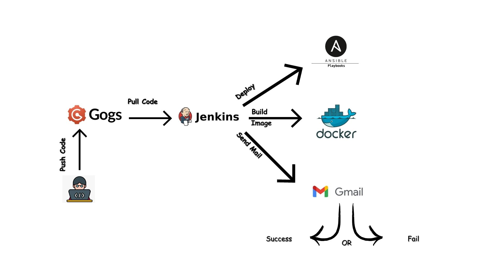

# Project: CI/CD Automation with Jenkins, Gogs, Ansible, and Docker

## Project Overview

This project aims to automate CI/CD processes using Jenkins for pipeline orchestration, Gogs for Git repository management, Ansible for configuration management, and Docker for containerization. The setup involves provisioning three VMs: VM1 for Jenkins, VM2 for Gogs, and VM3 for Apache server deployment.

### VM Setup Details

1. **VM1: Jenkins Server**
   - **IP Address:** 192.168.44.10
   - **Port:** 8080
   - **Username:** VM1

2. **VM2: Gogs Server**
   - **IP Address:** 192.168.44.20
   - **Port:** 3000
   - **Username:** VM2

3. **VM3: Apache Server**
   - **IP Address:** 192.168.44.30
   - **Port:** 8080
   - **Username:** apache

### Project Components

1. **User Management on VM3**

   - Use the `CreateUsers.sh` script to create users (Devo, Testo, Prodo) on VM3.
   - Add these users to the "deployG" group for centralized access control.

2. **Gogs Integration with Jenkins**

   - Configure webhooks in Gogs to trigger Jenkins pipelines upon code commits.
   - Jenkins monitors the Gogs repository for changes and initiates CI/CD workflows.

3. **Git Repository Setup on Gogs**

   - Create a Git repository on Gogs containing:
     - `InstallApache.yml`: Ansible playbook for Apache installation on VM3.
     - `NotGroupMembers.sh`: Bash script to list users not in the "deployG" group on VM3.

4. **CI/CD Pipeline Configuration**

   - Define a `Jenkinsfile` with stages:
     - **Stage 1: Ansible Execution**
       - Runs `InstallApache.yml` to install and configure Apache on VM3.
     - **Stage 2: Docker Image Build and Archive**
       - Builds a Docker image using a specified Dockerfile.
       - Saves the Docker image locally as `<image_name>.tar`.
       - Archives the Docker image tar file.
     - **Stage 3: Email Notification**
       - Sends email notifications on pipeline status.
       - Includes:
         - List of users in the "deployG" group.
         - Date and time of pipeline execution.
         - Path to the Docker image tar file.


# Ansible Configuration

[Ansible](https://www.ansible.com/) is used for automating deployment tasks on VM3.

## Ansible Configuration File (`ansible.cfg`)
 ### Upade the ansible configuration file:
   ```ini
    [defaults]
    remote_user = apache
    inventory = ./inventory 

    [privilege_escalation]
    become = true
  ```
 ### Configure the inventory file:
   ```ini
   [apache_hosts]
    192.168.44.30
   ```

## Ansible-playbook File (`InstallApache.yml`) to install Apache in VM3
 ### Ansible Playbook 
    - name: Install Apache on VM3
    hosts: apache_hosts
    gather_facts: no

    tasks:
        - name: Install Apache web server
        package:
            name: httpd  # Package name for Apache on CentOS
            state: present  # Ensure the package is present

        - name: Start Apache service and enable it on boot
        service:
            name: httpd  # Service name for Apache on CentOS
            state: started
            enabled: yes

        - name: Check if Apache service is enabled
        command: systemctl is-enabled httpd
        register: apache_enabled
        ignore_errors: true  # Ignore errors in case the service is not enabled

        - name: Print Apache service status
        debug:
            msg: "Apache service is {{ 'enabled' if apache_enabled.rc == 0 else 'not enabled' }}"


## Jenkins File to deploy the Ansible Playbook

#### Enviroment Variables
    agent any

    environment {
        IMAGE_NAME = "apache-image"
        TAR_FILE = "${IMAGE_NAME}.tar"
        LOCAL_SAVE_PATH = "/shared_data/apache-image"
        DEPLOYG_HOST = "192.168.44.30"
        APACHE_USER = "apache"  // Define your SSH user here
    }

#### First stage: Run Ansible playbook
    stage('Run Ansible Playbook') {
        steps {
            withCredentials([sshUserPrivateKey(credentialsId: 'apache-vm3', keyFileVariable: 'SSH_KEY', usernameVariable: 'SSH_USER')]) {
                script {
                    sh """
                    ANSIBLE_HOST_KEY_CHECKING=False ansible-playbook InstallApache.yml --private-key=${SSH_KEY}
                    """
                }
            }
        }
    }

#### Second stage: Build, save ,and tar Docker Image
       stage('Build Docker Image') {
            steps {
                script {
                    // Build the Docker image
                    sh "docker build -t ${IMAGE_NAME} ."
                }
            }
        }

        stage('Save Docker Image Locally') {
            steps {
                script {
                    // Save the Docker image to a tar file locally
                    sh "docker save ${IMAGE_NAME} > ${LOCAL_SAVE_PATH}/${TAR_FILE}"
                }
            }
        }

        stage('Create Tar Archive') {
            steps {
                script {
                    // Create a tar archive of the saved Docker image tar file
                    sh "tar -cvf ${LOCAL_SAVE_PATH}/${TAR_FILE}.tar -C ${LOCAL_SAVE_PATH} ${TAR_FILE}"
                }
            }
        }

#### Send email notification 
    post {
            always {
                script {
                    def status = currentBuild.result ?: 'SUCCESS'
                    def subject = "Pipeline ${status} - ${env.JOB_NAME} #${env.BUILD_NUMBER}"
                    def statusColor = status == 'SUCCESS' ? '#27ae60' : '#c0392b'

                    // Get the list of users in the "deployG" group
                    def usersInDeployG = ""
                    withCredentials([sshUserPrivateKey(credentialsId: 'apache-vm3', keyFileVariable: 'SSH_KEY', usernameVariable: 'SSH_USER')]) {
                        usersInDeployG = sh(
                            script: """
                            ssh -i ${SSH_KEY} ${SSH_USER}@${DEPLOYG_HOST} "grep '^deployG:' /etc/group | cut -d: -f4"
                            """,
                            returnStdout: true
                        ).trim()
                    }

                    // Send email notification
                    emailext (
                        to: 'mohamedmagdyy840@gmail.com',
                        subject: subject,
                        body: """
                            <html>
                            <head>
                                <style>
                                    body {
                                        font-family: Arial, sans-serif;
                                        line-height: 1.6;
                                        color: #2c3e50;
                                    }
                                    h2 {
                                        color: #2980b9;
                                        border-bottom: 2px solid #2980b9;
                                        padding-bottom: 5px;
                                    }
                                    p {
                                        margin: 5px 0;
                                    }
                                    .status {
                                        color: ${statusColor};
                                        font-weight: bold;
                                    }
                                    .date {
                                        color: #8e44ad;
                                        font-weight: bold;
                                    }
                                    .path {
                                        color: #e67e22;
                                        font-weight: bold;
                                    }
                                    .users {
                                        color: #3498db;
                                        font-weight: bold;
                                    }
                                </style>
                            </head>
                            <body>
                                <h2>Pipeline Execution Status</h2>
                                <p>Status: <span class="status">${status}</span></p>

                                <h2>Users in "deployG" Group</h2>
                                <p class="users">${usersInDeployG}</p>

                                <h2>Date and Time of Execution</h2>
                                <p class="date">${new Date()}</p>

                                <h2>Path to Docker Image</h2>
                                <p class="path">${LOCAL_SAVE_PATH}/${TAR_FILE}</p>
                            </body>
                            </html>
                        """,
                        mimeType: 'text/html',
                        from: 'jenkins@example.com',
                        replyTo: 'jenkins@example.com'
                    )
                }
            }
        }


